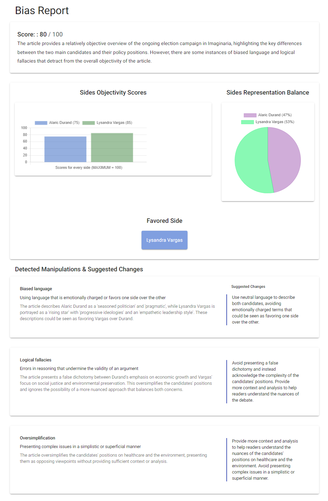

# HonestyMeter - A breakthrough framework for evaluating the objectivity and credibility of news articles.

## Introduction:

In today's world, the media plays a significant role in shaping public opinion and influencing decision-making processes. However, with the rise of fake news and misinformation, it has become increasingly challenging to distinguish between fact and fiction. The problem is compounded by the use of manipulative techniques such as sensationalism, framing, and selective reporting that are employed by media outlets to push their agendas.

To address this issue, we have developed the HonestyMeter framework - an innovative solution that enables users to evaluate the objectivity and bias of media content. The framework uses large language models such as gpt-3.5-turbo to analyze various media elements, including text, images, audio, and video, and identify manipulative techniques that may be present.

## Process:

The HonestyMeter framework uses a multistep process to evaluate the objectivity and bias of media content:

1. Input: The user provides a link to the media content, which can include text, images, audio, or video.
2. Analysis: The framework uses natural language processing and machine learning techniques to analyze the media content and identify any manipulative techniques that may be present. The analysis includes evaluating the tone, sentiment, and language used in the content.
3. Scoring: Based on the analysis, the framework provides an overall objectivity score for the media content on a scale of 0-100. Additionally, the framework scores the objectivity level for each side represented in the content.
4. Reporting: The framework generates a report summarizing the analysis, scores, and feedback provided for the media content.
5. Feedback: The framework provides feedback to the user on the manipulative techniques identified and the areas of the content that may be biased or lacking in objectivity and suggests possible improvements.
6. Improvement: The user can take the feedback provided by the framework and use it to improve the objectivity of the content.

   

## Future Plans

1. Support links to video and audio content (evaluate text, tonality, images and video content objectivity).

2. Connect to fact checking sources.

3. Compare multiple sources.

## Examples:

To illustrate the use of the HonestyMeter framework, consider the following example text:

"Company A announces record profits for the quarter. This is a clear indication that the company's management is doing an excellent job, and investors should feel confident in their investment."

The HonestyMeter framework would analyze this text and identify the following manipulative techniques:

- Framing: The text frames the news as a positive announcement for Company A, without providing any objective analysis of the results or considering any negative factors.
- Selective reporting: The text only reports on the positive news and does not consider any potential negative factors that may be affecting the company's profitability.
- Loaded language: The text uses words like "clear" and "excellent" to imply a positive interpretation of the news.

Based on the analysis, the HonestyMeter framework would provide an objectivity score of 60/100 and suggest improvements such as including a more balanced analysis of the company's profitability and considering potential negative factors that may be affecting the results.

### Example Report

 

### Important Considerations When Using the HonestyMeter Framework:

Prior to the release of HonestyMeter, content objectivity was never seriously evaluated. Therefore, when using the tool for the first time, you may be shocked by the high levels of subjectivity even in the content of the most well-known and authoritative mass media sources. It is essential to acknowledge that no one can be entirely objective, and some degree of bias is inevitable. Furthermore, a low objectivity score does not necessarily indicate malicious intent on the part of the mass media or journalists. Many instances of biased content are created unknowingly, with the best of intentions.

Our goal is not to blame anyone, but to provide a valuable tool for content creators and consumers alike that can help improve objectivity in media content. By using the HonestyMeter framework thoughtfully and with an understanding of its limitations, we can take a step towards creating a more reliable and trustworthy source of information for all.

## Conclusion:

The HonestyMeter framework is a game-changer in addressing media bias and misinformation. It will inevitably increase transparency and objectivity in mass media, by helping journalists and content creators to produce more objective content, empowering users to make informed decisions with ease and becoming an essential tool for anyone seeking truthful and unbiased information.

### Honest disclosure:

This white paper was evaluated by the HonestyMeter framework and found to be highly biased towards promoting mass media transparency and the use of the HonestyMeter. 😊

[BACK TO MAIN PAGE](https://github.com/BetterForAll/HonestyMeter)
